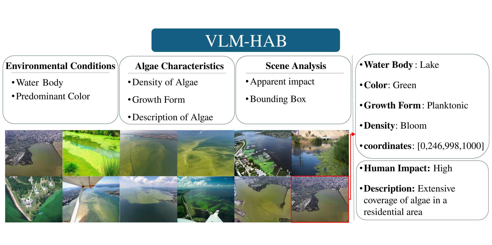

<div align="center">

# **Harnessing Vision-Language Models for Improved Detection and Analysis of Harmful Algal Blooms (HAB)**

</div>

This repository contains data for the VLM-HAB dataset. 

Paper link: Coming soon.  

**By: Dr. Anju R. Gupta and Jamal Ansary**

## visual grouding (VG) using replicate


To reproduce our results using Replicate:

1. Sign up for a Replicate account at [https://replicate.com](https://replicate.com)
2. Install the Replicate Python client:
3. Set up your API token
4. Run the following Python code:

```python
import base64
import os
import json
import re
import traceback
from PIL import Image, ImageDraw
import replicate

# Set up your Replicate API token
os.environ["REPLICATE_API_TOKEN"] = "your_api_key_here"

def encode_image_to_base64(image_path):
 try:
     with open(image_path, "rb") as image_file:
         return base64.b64encode(image_file.read()).decode("utf-8")
 except Exception as e:
     print(f"Error encoding image {image_path}: {str(e)}")
     return None

def scale_bbox(bbox, scale=1000):
 return tuple(int(coord * scale) for coord in bbox)

def draw_bounding_box(image, bbox, color='red', width=2):
 draw = ImageDraw.Draw(image)
 draw.rectangle(bbox, outline=color, width=width)
 return image

def extract_bounding_box_and_answer(text):
 answer_match = re.search(r'\b(yes|no)\b', text.lower())
 is_accurate = answer_match.group(1) if answer_match else None

 patterns = [
     r'<box>\((.*?),(.*?),(.*?),(.*?)\)</box>',
     r'\[(.*?),(.*?),(.*?),(.*?)\]',
     r'x1=(.*?),\s*y1=(.*?),\s*x2=(.*?),\s*y2=(.*?)'
 ]
 for pattern in patterns:
     match = re.search(pattern, text)
     if match:
         try:
             return tuple(map(float, match.groups())), is_accurate
         except ValueError:
             print(f"Invalid bounding box values: {match.groups()}")
 print("No valid bounding box found in the text.")
 return None, is_accurate

def run_replicate_model(image_url, prompt):
 try:
     output = replicate.run(
         "yorickvp/llava-13b:80537f9eead1a5bfa72d5ac6ea6414379be41d4d4f6679fd776e9535d1eb58bb",
         input={
             "image": image_url,
             "top_p": 1,
             "prompt": prompt,
             "max_tokens": 1024,
             "temperature": 0.2
         }
     )
     return "".join(list(output))
 except Exception as e:
     print(f"Unexpected error in Replicate API call: {str(e)}")
     return None

initial_prompt = """propose bounding boxes that cover the whole algae"""
follow_up_prompt = """I've drawn a red bounding box based on your previous proposal. The bounding box coordinates are: {bbox}. Please review this new image with the red bounding box and follow these instructions:

1. First, answer whether the red bounding box accurately encompasses all visible algae growth. Respond with either 'Yes' or 'No'.

2. Then, provide a bounding box using the format <box>(x1,y1,x2,y2)</box>. Follow these rules:
- If you answered 'Yes' in step 1, repeat the original bounding box coordinates: {bbox}
- If you answered 'No' in step 1, provide a new, more accurate bounding box that better encompasses all visible algae growth.
"""

# Replace 'your_image_directory' and 'your_output_directory' with appropriate paths
image_dir = 'your_image_directory'
output_dir = 'your_output_directory'
os.makedirs(output_dir, exist_ok=True)

print("Starting to process images")
for image_name in os.listdir(image_dir):
 if image_name.lower().endswith(('.jpg', '.jpeg', '.png', '.webp')):
     image_path = os.path.join(image_dir, image_name)
     print(f"Processing image: {image_name}")

     try:
         image_base64 = encode_image_to_base64(image_path)
         if image_base64 is None:
             raise ValueError(f"Failed to encode image: {image_name}")

         image_url = f"data:image/jpeg;base64,{image_base64}"

         print(f"Sending request to Replicate for initial bounding box proposal of {image_name}")
         initial_proposal = run_replicate_model(image_url, initial_prompt)

         if initial_proposal is None:
             raise ValueError(f"Failed to get initial bounding box proposal for {image_name}")

         print(f"Initial bounding box proposal for {image_name}:")
         print(initial_proposal)

         initial_bbox, _ = extract_bounding_box_and_answer(initial_proposal)

         if initial_bbox:
             scaled_initial_bbox = scale_bbox(initial_bbox)
             with Image.open(image_path) as img:
                 img_width, img_height = img.size
                 scaled_img = img.resize((1000, 1000))
                 img_with_bbox = draw_bounding_box(scaled_img.copy(), scaled_initial_bbox, color='red')
                 bbox_image_path = os.path.join(output_dir, f"{os.path.splitext(image_name)[0]}_with_bbox.png")
                 img_with_bbox.save(bbox_image_path)

             print(f"Processed and saved result for {image_name}")
             print(f"Result saved to: {bbox_image_path}")
             print("-" * 50)

     except Exception as e:
         print(f"Error processing {image_name}: {str(e)}")
         print("Traceback:")
         traceback.print_exc()
print("Processing complete. Results saved in the output directory.")
``` 

# Visual question answering (VQA) using  Gemini 


To replicate our results using Google Gemini:

1. Set up a Google Cloud account and enable the Gemini API
2. Install the Google Cloud SDK and authenticate
3. Install the Gemini Python client
4. Use the following Python code:

```python
import os
import json
import time
import re
from PIL import Image
import google.generativeai as genai

# Configure the Gemini API
def configure_api():
 api_key = "your_api_key_here"
 genai.configure(api_key=api_key)
 return genai.GenerativeModel(model_name="gemini-1.5-pro-latest")

def run_gemini_model(model, image_path, prompt):
 try:
     img = Image.open(image_path)
     response = model.generate_content([prompt, img])
     return response.text
 except Exception as e:
     print(f"Error in run_gemini_model: {str(e)}")
     return None

def process_image(model, image_path, prompt_text, max_attempts=3):
 for attempt in range(max_attempts):
     response = run_gemini_model(model, image_path, prompt_text)
     if response:
         print(f"Raw response: {response[:500]}...")
         json_data, explanation = extract_json_and_explanation(response)
         if json_data and validate_json_structure(json_data):
             return json_data, explanation
         else:
             print(f"Invalid JSON structure or extraction failed. Attempt {attempt + 1}")
     else:
         print(f"No response from model. Attempt {attempt + 1}")
     print(f"Attempt {attempt + 1} failed. Retrying...")
     time.sleep(5)
 return None, "Failed to generate valid JSON after multiple attempts."

def extract_json_and_explanation(text):
 json_match = re.search(r'```json\s*(.*?)\s*```', text, re.DOTALL)
 if not json_match:
     json_match = re.search(r'(\{.*\})', text, re.DOTALL)
 if json_match:
     json_str = json_match.group(1)
     try:
         json_data = json.loads(json_str)
         explanation_match = re.search(r'\*\*Explanation:\*\*(.*)', text, re.DOTALL)
         explanation = explanation_match.group(1).strip() if explanation_match else ""
         return json_data, explanation
     except json.JSONDecodeError as e:
         print(f"JSON decode error: {str(e)}")
         return None, text
 print("No JSON found in the response")
 return None, text

def validate_json_structure(json_data):
 json_template = {
     "Environmental Conditions": {"Water Body": ""},
     "Algae Characteristics": {"Color": "", "Growth Form": "", "Density": ""},
     "Human Impact": {"Level": ""}
 }
 if not isinstance(json_data, dict):
     print("JSON data is not a dictionary")
     return False
 for key, value in json_template.items():
     if key not in json_data:
         print(f"Missing key in JSON: {key}")
         return False
     if isinstance(value, dict):
         if not isinstance(json_data[key], dict):
             print(f"Value for key {key} is not a dictionary")
             return False
         for sub_key in value:
             if sub_key not in json_data[key]:
                 print(f"Missing sub-key in JSON: {key}.{sub_key}")
                 return False
 return True

# Replace 'your_image_directory' and 'your_output_directory' with appropriate paths
image_dir = 'your_image_directory'
output_dir = 'your_output_directory'
os.makedirs(output_dir, exist_ok=True)

# Get all image files in the directory
image_files = [f for f in os.listdir(image_dir) if f.lower().endswith(('.png', '.jpg', '.jpeg'))]

# Configure the API and get the model
model = configure_api()

# Define the prompt text
prompt_text = """As an expert in aquatic ecology and environmental assessment, analyze the given water body and its algal presence. Provide a detailed characterization in JSON format, covering the following aspects:
1. Environmental Conditions:
- Identify the water body type (Lake/Ocean/River/Pond/Aquarium)
2. Algae Characteristics:
- Describe the predominant color of the algae (Green/Red/Brown/Blue-green)
- Identify the growth form (Planktonic/Filamentous/Mat-forming/Attached)
- Estimate the density of algal growth (Sparse/Moderate/Dense/Bloom)
3. Human Impact:
- Evaluate the level of influence of harmful algae on humans living in nearby areas (Low/Moderate/High)
Provide your assessment in the following JSON format:
{
"Environmental Conditions": {
 "Water Body": ""
},
"Algae Characteristics": {
 "Color": "",
 "Growth Form": "",
 "Density": ""
},
"Human Impact": {
 "Level": ""
}
}
For each category, choose the most appropriate option from those provided. Base your analysis solely on the visible evidence in the image, making informed inferences where necessary.
After the JSON, provide a brief explanation for your Human Impact assessment:
**Explanation:**
* **Human Impact:**
 * [explanation]"""

for image_file in image_files:
 image_path = os.path.join(image_dir, image_file)
 print(f"Processing: {image_file}")
 json_data, explanation = process_image(model, image_path, prompt_text)
 if json_data:
     json_data["image_name"] = os.path.splitext(image_file)[0]
     json_data["explanation"] = explanation
     output_file = os.path.join(output_dir, f"{json_data['image_name']}_result.json")
     with open(output_file, 'w', encoding='utf-8') as file:
         json.dump(json_data, file, indent=2)
     print(f"Saved JSON result for {image_file}")
 else:
     print(f"Failed to process {image_file}")
print("Processing complete.")